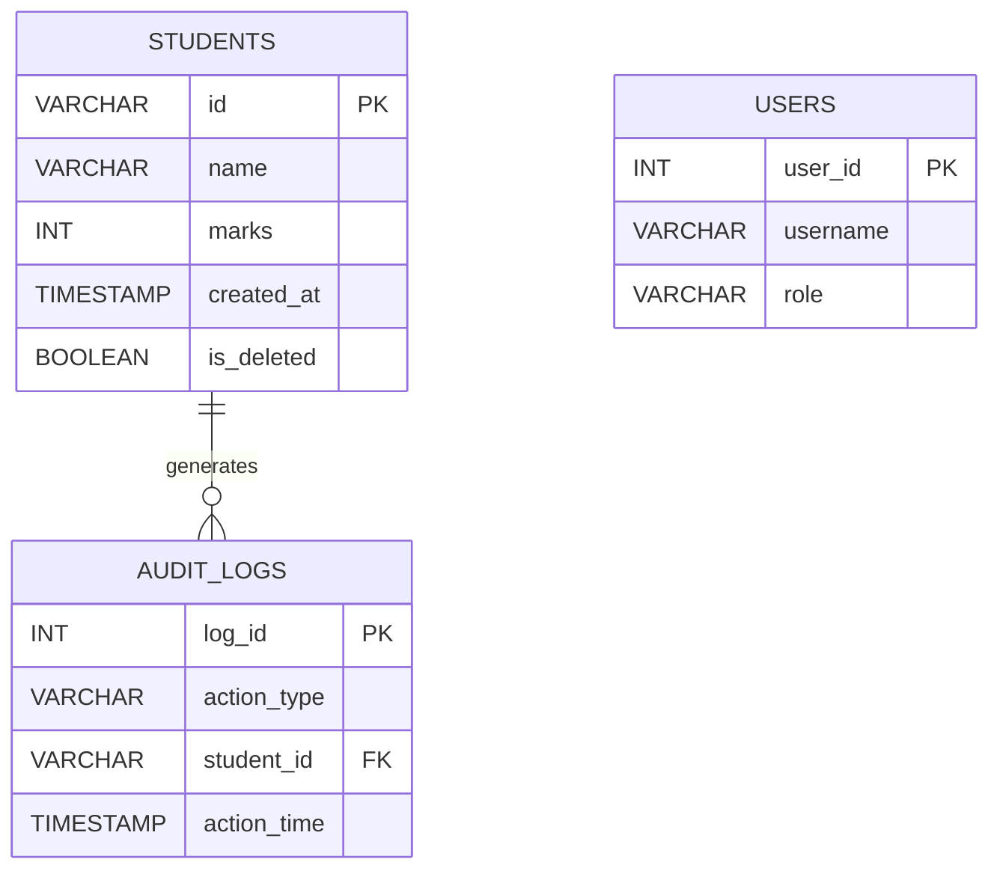

# Student Record Management System

A Python-based application to manage student records using SQLite database.

## Technologies Used
- Python
- Flask
- SQLite
- HTML

## Live Demo
https://akshhhh.pythonanywhere.com

## Features
- Add Student
- View Students
- Search Student
- Update Student Marks
- Delete Student
- Input Validation
- Database Timestamp Tracking

## Project Structure
student-record-management-system
│
├── main.py
├── app.py
├── database
│   └── db.py
├── models
│   └── student.py
├── templates
│   └── index.html
├── students.db
└── README.md

## Database Schema

