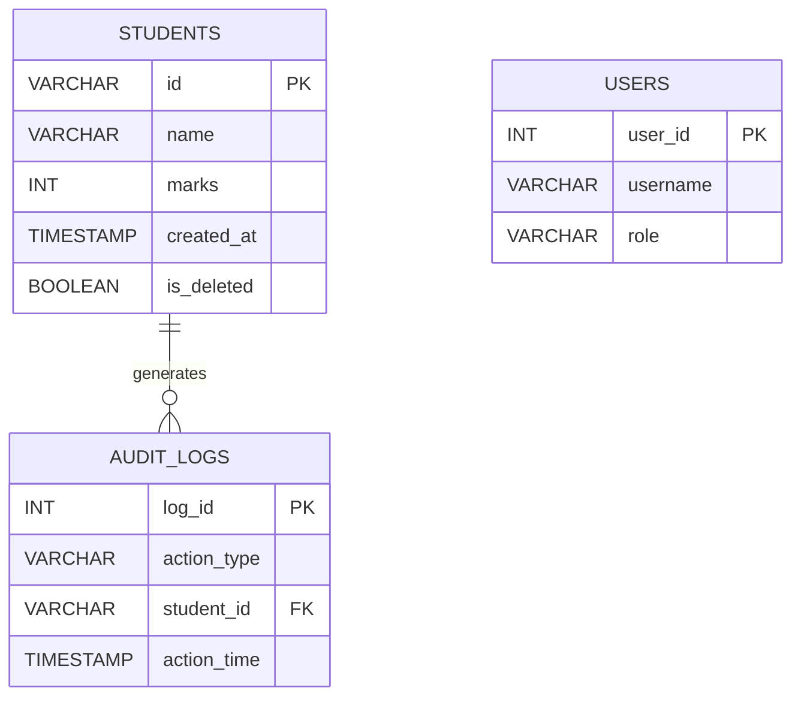

# Student Record Management System

A database-driven Student Record Management System built using Flask and MySQL for managing student information, monitoring database activities, and supporting administrative operations. The project demonstrates practical database administration concepts including audit logging, soft deletion, backup and recovery workflows, user role management, reporting, and database health monitoring.

## Technologies Used

* Python
* Flask
* MySQL
* HTML
* Bootstrap
* Pandas

## Live Demo

https://akshhhh.pythonanywhere.com

## Key Features

* Student Record Management (CRUD Operations)
* MySQL Database Integration
* Role-Based User Management (Admin, Faculty, Viewer)
* Database Audit Logging (Insert, Update, Delete Tracking)
* Soft Delete Mechanism for Data Recovery
* CSV Export Reporting
* Backup & Restore Scripts
* Database Health Monitoring Dashboard
* Input Validation and Data Integrity Checks
* Indexed Query Optimization
* Search Functionality
* Database Activity Tracking

## Database Administration Features

### Audit Logging

Tracks all database operations including:

* INSERT
* UPDATE
* DELETE

### Soft Delete

Records are marked as deleted instead of being permanently removed, enabling recovery and retention.

### Monitoring

Displays:

* Database Status
* Total Student Records
* Audit Log Statistics

### Backup & Recovery

Supports backup and restoration workflows for database recovery scenarios.

## Project Structure

```text
student-record-management-system
│
├── app.py
├── main.py
├── backup.bat
├── restore.bat
├── requirements.txt
├── database
│   └── db.py
├── models
│   └── student.py
├── templates
│   ├── index.html
│   └── search.html
├── reports
│   └── students_export.csv
└── README.md
```

## Database Schema



## Database Tables

### STUDENTS

Stores student records and academic information.

### AUDIT_LOGS

Maintains a history of all database operations for monitoring and traceability.

### USERS

Supports role-based access control and user administration.

## Future Enhancements

* Cloud Database Deployment (AWS RDS)
* Automated Scheduled Backups
* Authentication and Authorization
* Advanced Reporting Dashboard
* Real-Time Monitoring Alerts

## Learning Outcomes

* Relational Database Design
* Database Administration Fundamentals
* SQL Query Optimization
* Data Validation and Integrity
* Audit Logging and Monitoring
* Backup and Recovery Concepts
* Role-Based Access Control
* Reporting and Data Export

## Author

Akshaya Pasunooti

B.Tech CSE (IoT)
