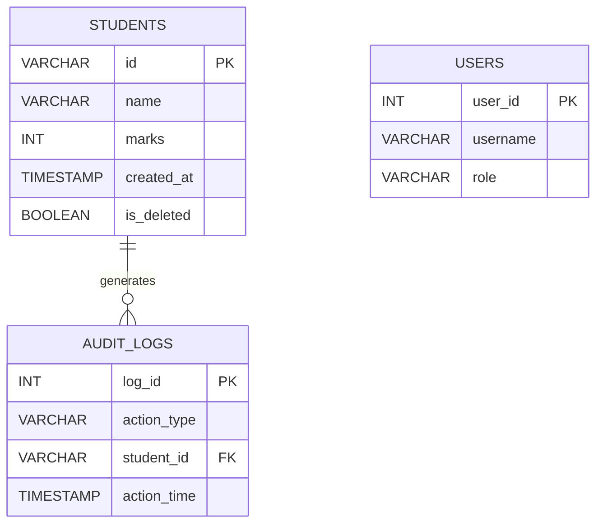

# Student Record Management System

A Python-based application to manage student records using SQLite database.

## Technologies Used
- Python
- Flask
- SQLite
- HTML

## Live Demo
https://akshhhh.pythonanywhere.com

## Key Features

- MySQL Database Integration
- Role-Based User Management
- Database Audit Logging
- Soft Delete for Data Recovery
- CSV Export Reporting
- Backup & Restore Scripts
- Database Health Monitoring
- Input Validation
- Indexed Query Optimization

## Project Structure
student-record-management-system
│
├── main.py
├── app.py
├── database
│   └── db.py
├── models
│   └── student.py
├── templates
│   └── index.html
├── students.db
└── README.md

## Database Schema

### Database Tables

- Students – stores student information and academic records.
- Audit_Logs – tracks all INSERT, UPDATE, and DELETE operations.
- Users – supports role-based access control and user management.
